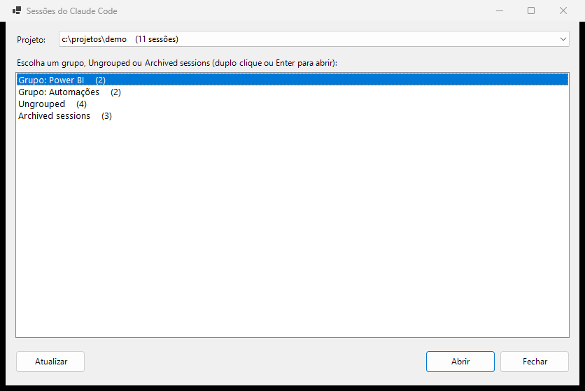
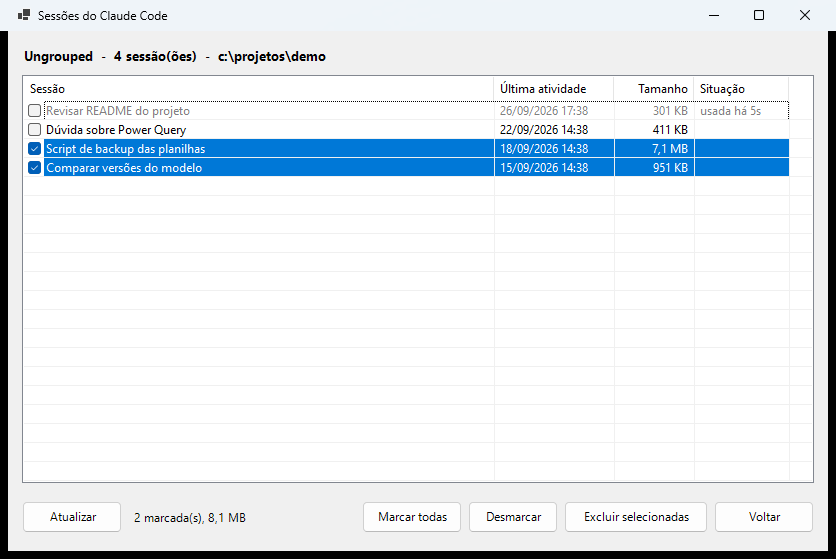
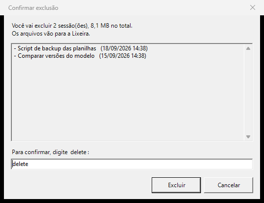
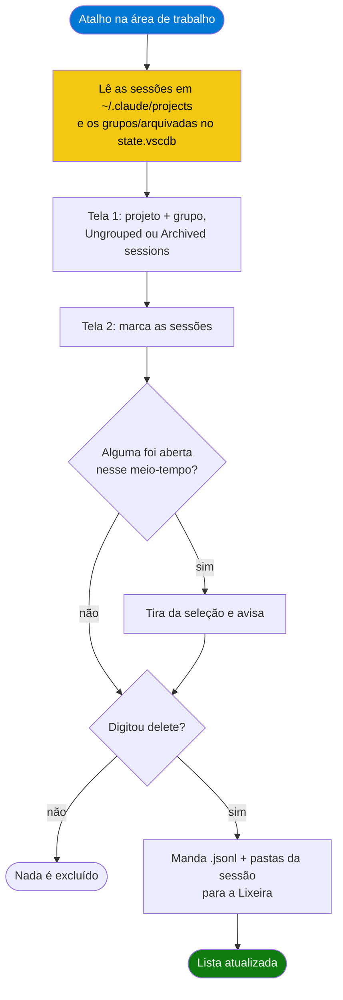

<div align="center">

# delete-claude-sessions

**Janela para Windows que exclui de verdade as sessões do Claude Code na extensão do VS Code, escolhendo por grupo, Ungrouped ou Archived sessions.**


[](https://github.com/bsgustavo/delete-claude-sessions/actions/workflows/tests.yml)

[](LICENSE)

</div>

---

## Visão Geral

A partir da v2.1.257, a extensão do Claude Code para VS Code trocou o botão **Delete session** por **Archive**. Arquivar só esconde a sessão: o histórico continua em `~\.claude\projects` ocupando espaço (sessões longas passam de 50 MB), e a lista de **Archived sessions** só cresce, porque a extensão arquiva sozinha toda sessão parada há 14 dias (configuração `claudeCode.archiveInactiveSessions`).

Este projeto é uma janela, aberta por um atalho na área de trabalho, que lista as sessões do jeito que a extensão organiza (grupos, Ungrouped e Archived sessions) e exclui as que você marcar. A exclusão exige digitar `delete` e manda os arquivos para a **Lixeira**, então um engano ainda tem volta.

> [!NOTE]
> É um projeto da comunidade, sem vínculo com a Anthropic e sem endosso dela. Ele lê arquivos internos da extensão, que não são documentados e podem mudar numa versão nova. Validado com a extensão **2.1.283**.

## Funcionalidades

- **Mesma organização da extensão.** Você escolhe o projeto e depois um grupo, `Ungrouped` ou `Archived sessions`, com a contagem de cada um. Sessão arquivada sai do grupo, como no VS Code.
- **Nome que você reconhece.** Mostra o título da sessão (o nome que você deu ao renomear ou o título gerado pela IA), a última atividade e o tamanho em disco.
- **Protege sessão aberta.** Sessão com processo `claude` vivo, ou gravada nos últimos 30 segundos, aparece em cinza e não pode ser marcada; a coluna Situação diz o motivo (`aberta agora` ou `usada há 12s`). A checagem é refeita na hora de excluir.
- **Atualizar.** Fechou uma sessão no VS Code? Clique em **Atualizar** (ou aperte F5) e ela fica liberada, sem sair da tela em que você está: projeto, grupo e marcações são mantidos.
- **Confirmação por digitação.** O botão Excluir só habilita quando você digita `delete` (minúsculo). Qualquer outra coisa, inclusive `Delete`, mantém o botão travado.
- **Vai para a Lixeira.** Exclui o `.jsonl`, a pasta de subagentes e resultados da sessão, e os restos em `file-history` e `session-env`. Tudo pode ser restaurado pela Lixeira.
- **Nunca toca no que não é sessão.** Só aceita nomes no formato GUID. A pasta `memory\` (memória do Claude) e qualquer outro arquivo ficam intactos.
- **Só leitura no VS Code.** O banco de estado do VS Code é apenas lido, nunca gravado.
- **Modo `-Probe`.** Lista tudo no console sem abrir janela e sem excluir nada.

## Telas

Capturas feitas com dados de demonstração.

**1. Escolher o projeto e o grupo**



**2. Marcar as sessões** (a sessão aberta aparece em cinza, com o motivo na coluna Situação)



**3. Confirmar digitando `delete`**



## Como Funciona



De onde vem cada informação:

| O quê | Onde fica |
|---|---|
| Sessões | `~\.claude\projects\<projeto>\<id>.jsonl` (+ pasta `<id>\` com subagentes e resultados de ferramentas) |
| Projeto | a pasta do workspace com tudo que não é letra/dígito trocado por `-` (`c:\projetos\demo` → `c--projetos-demo`) |
| Título | último registro `custom-title` (renomeada) no `.jsonl`; senão `ai-title`, `summary` ou `last-prompt` |
| Grupos | `%APPDATA%\Code\User\globalStorage\state.vscdb`, tabela `ItemTable`, chave `Anthropic.claude-code`, campo `sessionGroups:<pasta do workspace>` |
| Arquivadas | mesma chave, campo `hiddenSessionIds` (lista global) |
| Sessão aberta | `~\.claude\sessions\<pid>.json` com o processo ainda vivo (o arquivo some quando a sessão é fechada) |

O `state.vscdb` é lido com o `winsqlite3.dll` que já vem no Windows, sem instalar nada. O script não grava nele: com o VS Code aberto, a extensão sobrescreveria a mudança com a cópia que mantém em memória.

## Pré-requisitos

| Requisito | Detalhe |
|---|---|
| Windows 10 ou 11 | usa Windows Forms, a Lixeira e o `winsqlite3.dll` do sistema |
| PowerShell 7 | `winget install Microsoft.PowerShell` (o Windows PowerShell 5.1 não serve) |
| Claude Code no VS Code | a extensão cria as pastas e o banco que o script lê |

## Instalação

```powershell
git clone https://github.com/bsgustavo/delete-claude-sessions.git
cd delete-claude-sessions
pwsh -File .\Instalar-Atalho.ps1
```

Isso cria o atalho **Sessões do Claude** na área de trabalho, apontando para o script desta pasta. Se você mover a pasta, rode o `Instalar-Atalho.ps1` de novo. Para tirar o atalho: `pwsh -File .\Instalar-Atalho.ps1 -Remover`.

Baixou o ZIP em vez de clonar? O Windows marca os arquivos como vindos da internet e o PowerShell se recusa a rodá-los. Desbloqueie uma vez antes de instalar:

```powershell
Get-ChildItem -Recurse | Unblock-File
```

## Uso

1. Abra o atalho **Sessões do Claude**.
2. Escolha o projeto no topo e, na lista, um grupo, `Ungrouped` ou `Archived sessions`. Duplo clique ou Enter abre.
3. Marque as sessões. **Marcar todas** pula as que estão abertas. Se fechar uma sessão no VS Code nesse meio-tempo, clique em **Atualizar** (F5) para liberá-la.
4. Clique em **Excluir selecionadas**, confira a lista e digite `delete`.
5. Se alguma sessão ainda aparecer no VS Code, rode `Developer: Reload Window`.

Esc volta da tela de sessões para a de grupos; na tela de grupos, fecha a janela.

Para só conferir o que o script enxerga, sem janela e sem excluir nada:

```powershell
pwsh -File .\Excluir-SessoesClaude.ps1 -Probe
```

## Configuração

Não há arquivo de configuração. Os caminhos têm padrão e podem ser trocados por parâmetro:

| Parâmetro | Padrão | Quando mudar |
|---|---|---|
| `-ClaudeHome` | `%USERPROFILE%\.claude` | `CLAUDE_CONFIG_DIR` apontando para outra pasta |
| `-StateDb` | `%APPDATA%\Code\User\globalStorage\state.vscdb` | VS Code Insiders, Cursor ou instalação portátil |
| `-Probe` | desligado | listar no console sem janela e sem excluir |

## Estrutura do projeto

```
delete-claude-sessions/
├── Excluir-SessoesClaude.ps1      # a janela e o modo -Probe
├── Instalar-Atalho.ps1            # cria/remove o atalho na área de trabalho
├── tests/
│   └── Executar-Testes.ps1        # testes com ~/.claude e state.vscdb falsos
├── docs/screenshots/              # capturas do README
├── .github/                       # CI e templates de issue e pull request
├── CHANGELOG.md
├── CONTRIBUTING.md
├── LICENSE
└── README.md
```

## Testes

```powershell
pwsh -File .\tests\Executar-Testes.ps1            # 43 verificações
pwsh -File .\tests\Executar-Testes.ps1 -Janela    # 52: também opera a janela de verdade
```

As verificações rodam num `~\.claude` e num `state.vscdb` falsos, criados em `tests\tmp`. Cobrem a ordem dos títulos, grupos e arquivadas, grupos de outro workspace, sessão aberta por processo vivo e por gravação recente, PID morto, o modo `-Probe`, a trava do `delete` e a exclusão (incluindo a recusa de nomes fora do padrão GUID e a pasta `memory\` intacta). O que a exclusão manda para a Lixeira durante o teste é tirado de lá no fim. As sessões reais não são tocadas.

Com `-Janela`, o app também é aberto com os dados falsos e operado por UI Automation: Abrir, Voltar, Esc, e uma sessão presa por um processo `claude` falso, que o Atualizar libera quando ele fecha. O teste só mexe na janela que ele mesmo abriu, mesmo que você esteja com o app aberto. Tudo, inclusive o `-Janela`, roda a cada push e pull request no GitHub Actions (`windows-latest`).

## Troubleshooting

| Sintoma | Causa | Ação |
|---|---|---|
| Aviso "Não consegui ler os grupos e as arquivadas" | o `state.vscdb` está em outro caminho (Insiders, Cursor, portátil) | rode com `-StateDb <caminho>` e ajuste o atalho |
| Sessão excluída continua na lista do VS Code | a lista do VS Code não recarregou | `Developer: Reload Window` |
| Grupo vazio continua no VS Code | o script não grava no `state.vscdb` | remova o grupo pela própria extensão |
| Sessão em cinza, sem poder marcar | `aberta agora`: processo `claude` vivo; `usada há Ns`: gravada há menos de 30 segundos | feche a sessão no VS Code (ou espere alguns segundos) e clique em **Atualizar** |
| O atalho não abre nada | PowerShell 7 não encontrado, ou arquivos bloqueados depois de baixar o ZIP | rode `pwsh -File .\Excluir-SessoesClaude.ps1 -Probe` para ver o erro; `Unblock-File` se precisar; depois o `Instalar-Atalho.ps1` de novo |

## Limitações Conhecidas

- O formato do `state.vscdb` e dos `.jsonl` não é documentado. Se uma versão nova da extensão mudar as chaves, os grupos podem sumir da janela (tudo cai em `Ungrouped`). Rode o `-Probe` e compare com o VS Code antes de excluir, e [abra uma issue](https://github.com/bsgustavo/delete-claude-sessions/issues).
- IDs de sessões excluídas continuam nos grupos e nas arquivadas do `state.vscdb`. São inofensivos: a extensão só mostra sessões que existem em disco.
- Sessões de worktree ficam em outra pasta de projeto e aparecem como outro projeto na janela.
- O histórico de prompts (`~\.claude\history.jsonl`) não é alterado.
- Só Windows.

## Roadmap

- [ ] Limpar os IDs órfãos do `state.vscdb` quando o VS Code estiver fechado
- [ ] Busca por texto na lista de sessões
- [ ] Opção de exclusão definitiva, sem Lixeira

## Como contribuir

Issues e pull requests são bem-vindos. Veja o [CONTRIBUTING.md](CONTRIBUTING.md) para rodar os testes e conhecer a convenção de commits.

## Autor

Feito por **Gustavo Schmeier** · [github.com/bsgustavo](https://github.com/bsgustavo)

## Licença

[MIT](LICENSE). Claude e Claude Code são marcas da Anthropic, PBC.
